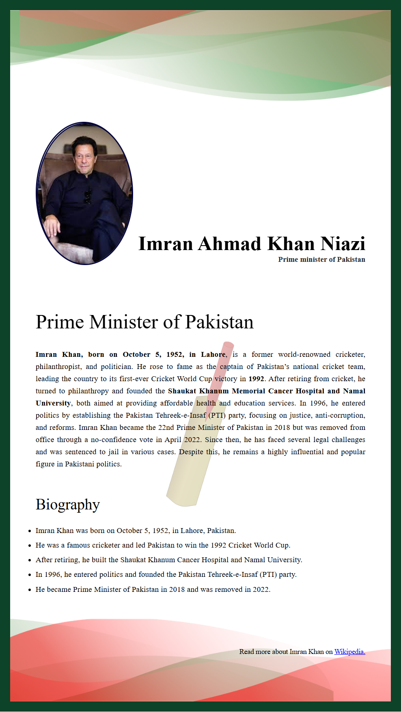
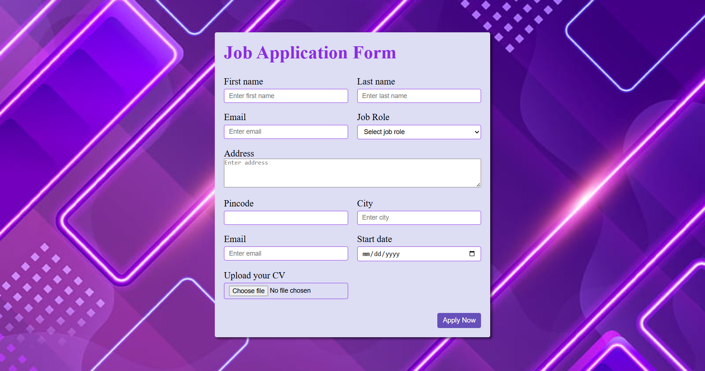
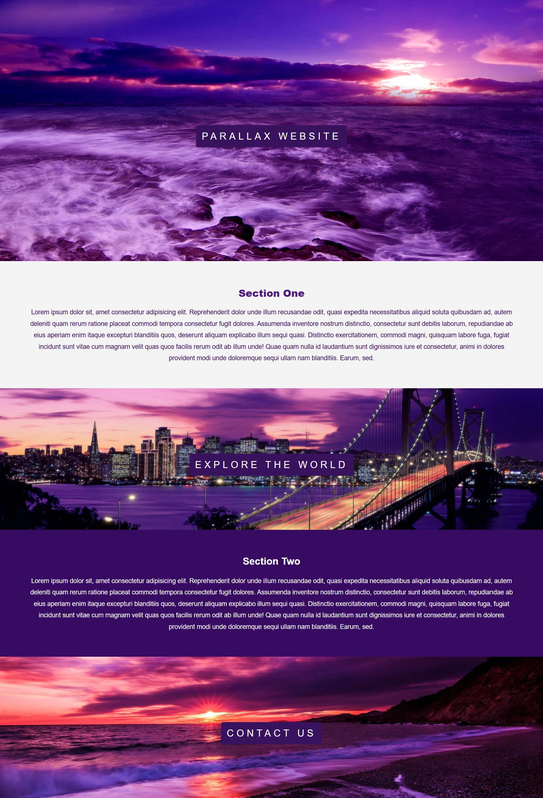
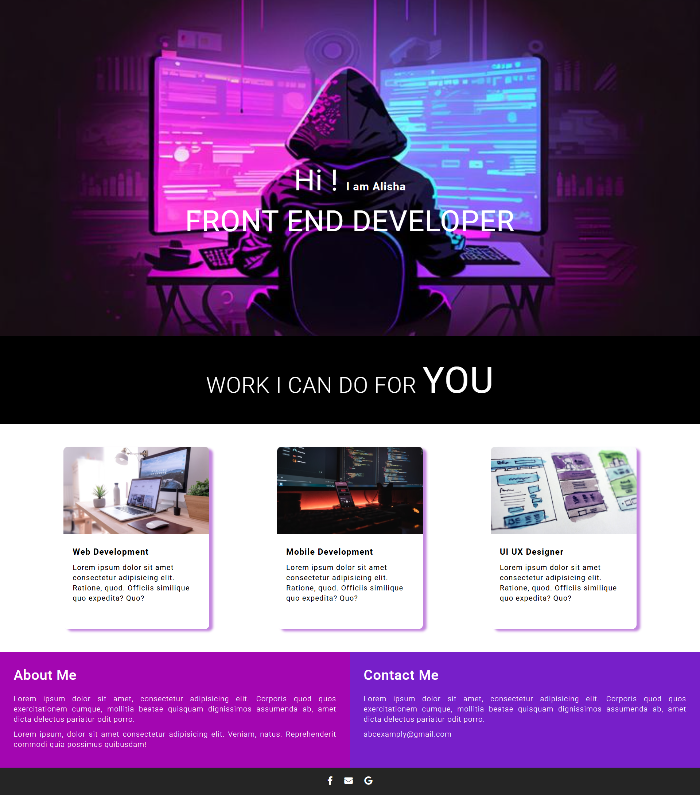
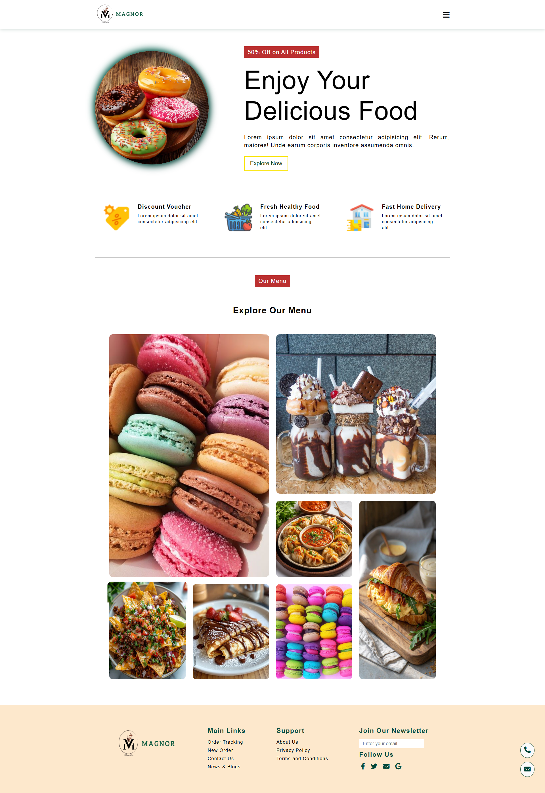
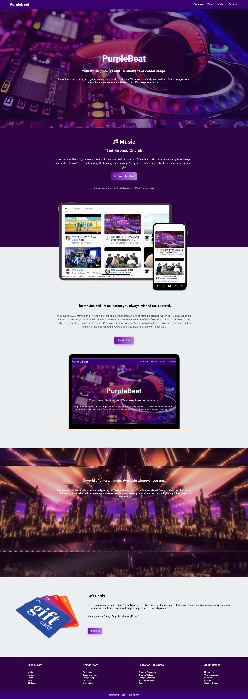
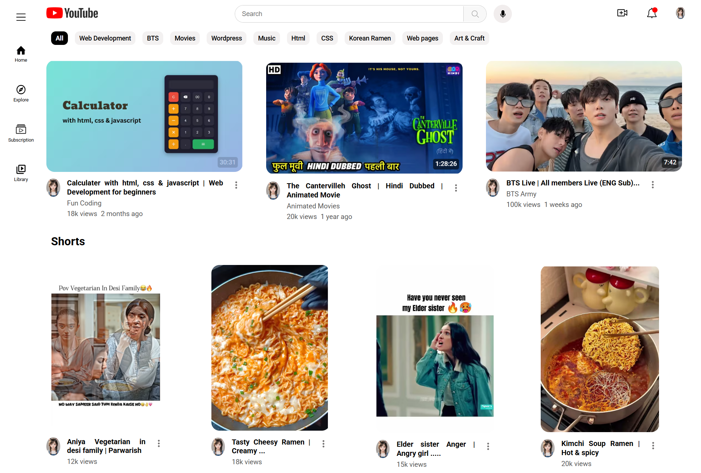
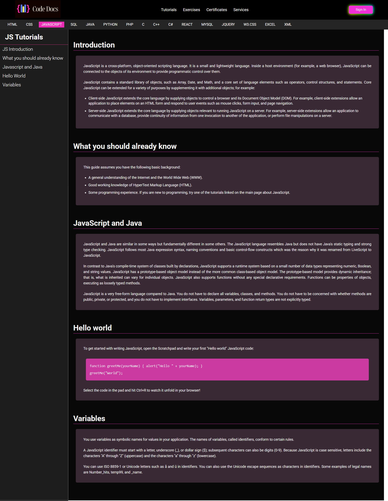
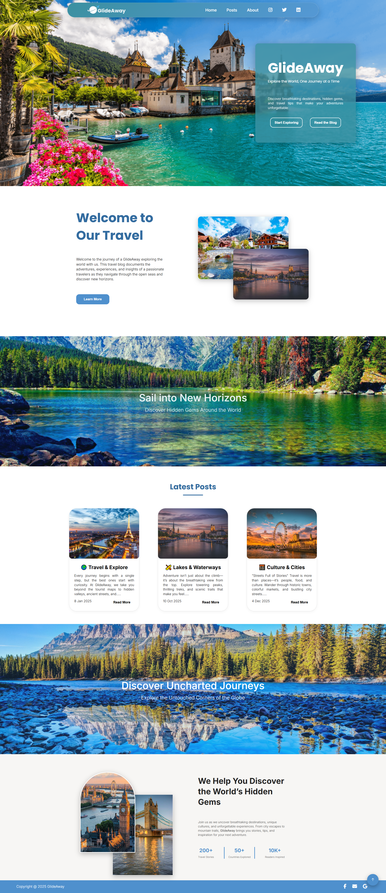

# Mini-Projects Portfolio

This repository showcases a collection of mini-projects developed to demonstrate core front-end web development skills. Each project focuses on specific aspects of web design, ranging from static page architecture to interactive user interfaces.

## Project Overview

| # | Project Name | Primary Focus |
| :--- | :--- | :--- |
| 1 | **Biography** | Semantic HTML structure for personal profiles. |
| 2 | **Application Form** | User input handling and form validation. |
| 3 | **Parallax Website** | Implementation of scroll-based visual effects. |
| 4 | **Landing Page** | Professional UI/UX layout design. |
| 5 | **Cafe Website** | Layout management for service-oriented platforms. |
| 6 | **Music Website** | Multimedia-centric design and grid layouts. |
| 7 | **YouTube Clone** | Simulation of video-sharing platform architecture. |
| 8 | **Documentation Website** | Clean typography and technical content presentation. |
| 9 | **Blog Website** | Dynamic content structure and layout. |

---

## 📸 Project Previews

| Project | Preview |
| :--- | :--- |
| **Biography** | {width="400"} |
| **Application Form** | {width="400"} |
| **Parallax Website** | {width="400"} |
| **Landing Page** | {width="400"} |
| **Cafe Website** | {width="400"} |
| **Music Website** | {width="400"} |
| **YouTube Clone** | {width="400"} |
| **Documentation Website** | {width="400"} |
| **Blog Website** |  |

---

## 🛠 Technical Skills
*   **Markup:** HTML5
*   **Styling:** CSS3 (incorporating fluid, responsive design principles)

---

